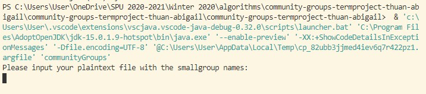
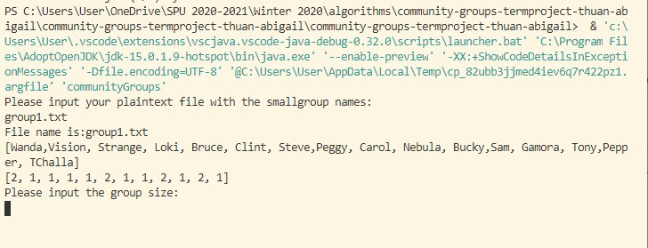
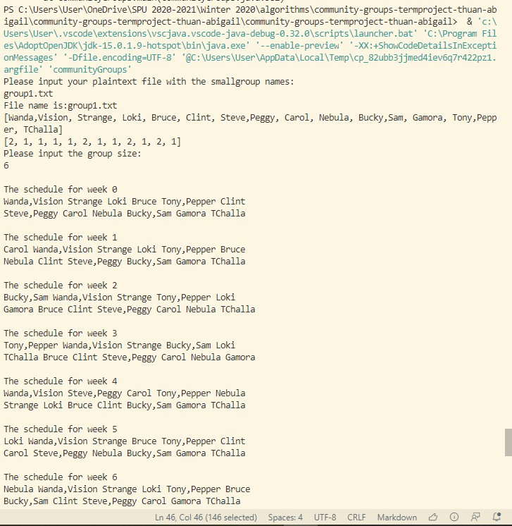
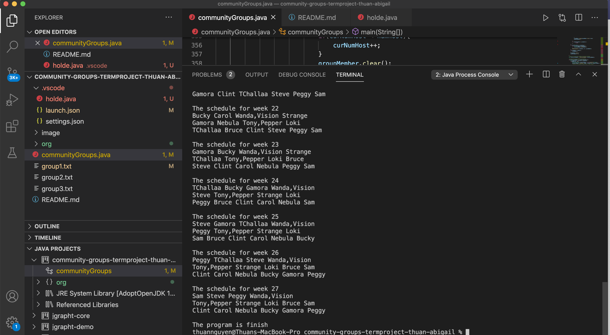
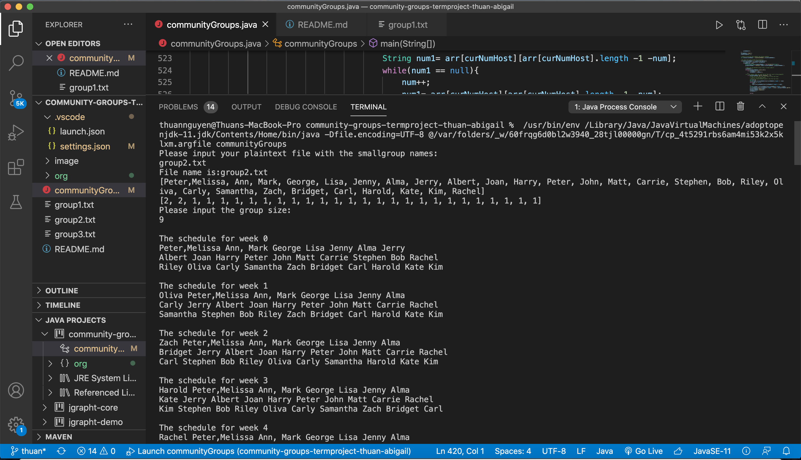
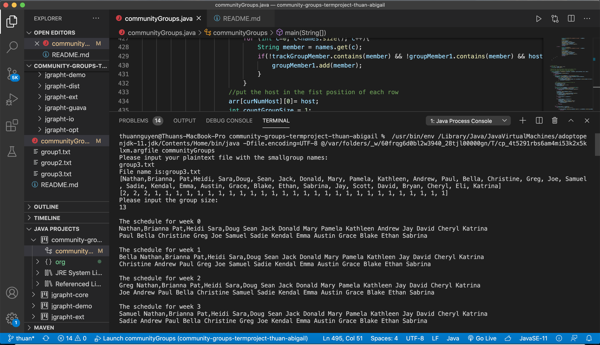

# Creating Community Small Groups
A work by:  Thuan Nguyen and Abigail Joppa

The problem we are trying to solve with this program is creating weekly small group Bible studies from a list of church members that will change every week so everyone has a chance to vist everyone elses home by the end of the weeks. So, our goal with this project was to create a program that would take in a list of names and the desired group size from the user and print out the list of groups for each week such that everyone will eventually visit everyone's home. 

## Description

We utilized the language Java for our program, as well as the jgrapht library. 
Obviously first we have the user input the txt file that conatins the list of names and also the desired group size for the small groups. We store the names in an arrayList, and then create another arrayList that stores the number of people in each household from that name arrayList. 
For our program we relized that a complete directed graph (i.e. every node has a edge that conects to every other node) would represent the end product of the small groups. So, if we successfully got everyone to visit everyone's home, then we will have a complete graph. 
Then we calculate how many host's are needed per week, and how many extra people we will have. 
To do this, we have a directed graph (from jgrapht), a trackGroupMember, a groupMember, and a 2D array. The trackGroupMember is the arrayList that keeps track of the member who has alread been on the schedule for that particular week. The groupMember is the arrayList that keeps the member's name for each host. The 2D array is keeping track of the data of each week and host and the first one on each of the rows is the host. 
Both trackGroupMember and the 2D array will clear after each week schedule is made. GroupMember will clear after each host has enough members. 

We add then data of the host to the groupMember. 
Then we add members to the groups based on the condition of the number of people who have already been to that persons house. In the normal case we check the groupMember array to determine what members are have not been to that host yet and add members until the group becomes full. In the other case, we have two hosts that need the same members in order to make the graph complete so we have a separate section of code that makes two more weeks such that the both hosts have a chance to host the needed members to complete the graph. 

## Requirements

- We utilized Visual Studio Code with Microsoft's Java Extension Pack. (https://code.visualstudio.com/docs/languages/java)
- We also used the jgrapht library. (https://jgrapht.org/). We need to add this java library file in Referenced Library.

## User Manual

<u>YouTube Video:</u>

https://youtu.be/KVFUqtmFlMk

<u>Instructions:</u> 

1. Once you clone the program into your computer, ensure that the jgrapht jar files are in the Refernce Library. If not, you should add it into the Reference library in your Java Project
2. Run the program using java compiler
3. Input the name of the txt file that you want to create small groups from: 

4. Once you input the txt file, it will output the names in that file and an array containing the number of people in each house hold. You then input the number of people in the small group you would like:

5. Once you enter, the algorithm will run and output the groups for each week, with the first person of each line being the host:

## Reflection

  
In order to find the set of sets of groups in the minimum number of iterations, the algorithm could use an adjacency matrix to store who has visited who’s home. First go through the list of names choosing the first person as the host and add members to the list until they reach the max group size noting who has been to whose house as you go (label in the adjacency matrix as week 1). Then from there repeat until all the names for the first week are accounted for. Then start on the second name for the host and repeat until all names are accounted for for week two keeping track of who has visited whose house and ensuring that there is no one who is repeating (labeling in the adjacency matrix as week two). Continue in this way until everyone has hosted everyone (labeling in the matrix which week they go to each host). 

The time complexity of that algorithm is 0(n^2) when n is the vertices. By create a adjacency matrix we need to build a square n*n.  When the graph is complete, we will have n(n-1)/2 edges. 

The time complexity of the algorithm we used for our programming is O(n^2), but worst case the time complexity is O(n^3). We used nested for loops in our algorithm to decide who is the host each of the small groups and to decide who the members are of the small groups for each week (O(n^2)); however, if we have to reenter the while loop because not everyone has visited everyone then the time complexity is worse case (O(n^3)). 

One of the biggest difficulties we had to overcome in this project was figuring out how to keep track of the names in such a way that ensured that every person visited every other person’s house. Because we started with using the directed graph as our data type we were able to know who was matched but struggled to figure out how to store who was where each week. To remedy this we implemented a 2D array to keep track of who has visited each home.
We also had troubles figuring out how to handle an uneven number of people. Like when the number of people in the txt file was 16 and we wanted groups of 6, there were 4 people we needed to account for and add onto the small groups. We remedy that by distributing them as evenly as possible to each of the small groups each week. Lastly one problem we had was the program stopped because it was not a complete graph but didn’t know how to handle two hosts that still needed the same members to finish the graph. To remedy this we created a separate “special” case that handled this by assigning the first host the people and repeating people for the other and then switching the next week thus “completing” the graph. 

## Results

<h3><u>Code Outputs and Screenshots:</u></h3>

<h3>GROUP1.TXT</h3>

<h3>
Please input your plaintext file with the smallgroup names: 
group1.txt 
file name is:group1.txt 
[Wanda,Vision, Tony,Pepper, Strange, Loki, Bruce, Clint, Carol, Nebula, Bucky, Gamora, TChallaa, Steve, Peggy, Sam] 
[2, 2, 1, 1, 1, 1, 1, 1, 1, 1, 1, 1, 1, 1] 
Please input the group size: 
5 
</h3>

The schedule for week 0 
Wanda,Vision Tony,Pepper Strange  
Loki Bruce Clint Carol Nebula  
Bucky Gamora TChallaa Steve Peggy Sam  

The schedule for week 1 
Gamora Wanda,Vision Tony,Pepper  
TChallaa Strange Loki Bruce Clint  
Steve Carol Nebula Bucky Peggy Sam  

The schedule for week 2 
Peggy Wanda,Vision Tony,Pepper  
Sam Strange Loki Bruce Clint  
Carol Nebula Bucky Gamora TChallaa Steve  

The schedule for week 3 
Nebula Wanda,Vision Tony,Pepper  
Bucky Strange Loki Bruce Clint  
Gamora Carol TChallaa Steve Peggy Sam  

The schedule for week 4 
TChallaa Wanda,Vision Tony,Pepper  
Steve Strange Loki Bruce Clint  
Peggy Carol Nebula Bucky Gamora Sam  

The schedule for week 5 
Sam Wanda,Vision Tony,Pepper  
Strange Loki Bruce Clint Carol  
Nebula Bucky Gamora TChallaa Steve Peggy  

The schedule for week 6 
Bucky Wanda,Vision Tony,Pepper  
Gamora Strange Loki Bruce Clint  
TChallaa Carol Nebula Steve Peggy Sam  

The schedule for week 7 
Steve Wanda,Vision Tony,Pepper  
Peggy Strange Loki Bruce Clint  
Sam Carol Nebula Bucky Gamora TChallaa  

The schedule for week 8 
Wanda,Vision Loki Bruce Clint  
Tony,Pepper Strange Carol Nebula  
Bucky Gamora TChallaa Steve Peggy Sam  

The schedule for week 9 
Wanda,Vision Carol Nebula Bucky  
Tony,Pepper Loki Bruce Clint  
Strange Gamora TChallaa Steve Peggy Sam  

The schedule for week 10 
Loki Wanda,Vision Tony,Pepper  
Bruce Strange Clint Carol Nebula  
Bucky Gamora TChallaa Steve Peggy Sam  

The schedule for week 11 
Wanda,Vision Gamora TChallaa Steve  
Tony,Pepper Bucky Peggy Sam  
Strange Nebula Loki Bruce Clint Carol  

The schedule for week 12 
Wanda,Vision Peggy Sam Strange  
Tony,Pepper Gamora TChallaa Steve  
Clint Loki Bruce Carol Nebula Bucky  

The schedule for week 13 
Carol Wanda,Vision Tony,Pepper  
Nebula Strange Loki Bruce Clint  
Bucky Gamora TChallaa Steve Peggy Sam  

The schedule for week 14 
Tony,Pepper Wanda,Vision Strange  
Loki Bucky Gamora TChallaa Steve  
Carol Bruce Clint Peggy Sam Nebula  

The schedule for week 15 
Nebula Carol Sam Wanda,Vision  
Bucky Tony,Pepper Strange Loki  
Gamora Bruce Clint TChallaa Steve Peggy  

The schedule for week 16 
Strange Wanda,Vision Tony,Pepper  
Loki Peggy Sam Bruce Clint  
Carol Nebula Bucky Gamora TChallaa Steve  

The schedule for week 17 
Strange Bucky Wanda,Vision Loki  
Bruce Tony,Pepper Gamora TChallaa  
Carol Clint Nebula Steve Peggy Sam  

The schedule for week 18 
Loki Strange Wanda,Vision Bruce  
Clint Tony,Pepper Gamora TChallaa  
Carol Nebula Bucky Steve Peggy Sam  

The schedule for week 19 
Bruce Wanda,Vision Loki Bucky  
Clint Strange Steve Peggy Sam  
Carol Tony,Pepper Nebula Gamora TChallaa  

The schedule for week 20 
Bruce Steve Peggy Sam Strange  
Clint Wanda,Vision Tony,Pepper  
Carol Loki Nebula Bucky Gamora TChallaa  

The schedule for week 21 
Carol Strange Wanda,Vision Loki  
Bucky Nebula Tony,Pepper Bruce  
Gamora Clint TChallaa Steve Peggy Sam  

The schedule for week 22 
Bucky Carol Wanda,Vision Strange  
Gamora Nebula Tony,Pepper Loki  
TChallaa Bruce Clint Steve Peggy Sam  

The schedule for week 23 
Gamora Bucky Wanda,Vision Strange  
TChallaa Tony,Pepper Loki Bruce  
Steve Clint Carol Nebula Peggy Sam  

The schedule for week 24 
TChallaa Bucky Gamora Wanda,Vision  
Steve Tony,Pepper Strange Loki  
Peggy Bruce Clint Carol Nebula Sam  

The schedule for week 25 
Steve Gamora TChallaa Wanda,Vision  
Peggy Tony,Pepper Strange Loki  
Sam Bruce Clint Carol Nebula Bucky  

The schedule for week 26 
Peggy TChallaa Steve Wanda,Vision  
Tony,Pepper Strange Loki Bruce Sam  
Clint Carol Nebula Bucky Gamora Peggy  

The schedule for week 27 
Sam Steve Peggy Wanda,Vision  
Tony,Pepper Strange Loki Bruce Sam  
Clint Carol Nebula Bucky Gamora Peggy  

The program is finish

<h3>GROUP2.TXT</h3>

<h3>
Please input your plaintext file with the smallgroup names: 
group2.txt 
File name is:group2.txt 
[Peter,Melissa, Ann, Mark, George, Lisa, Jenny, Alma, Jerry, Albert, Joan, Harry, Peter, John, Matt, Carrie, Stephen, Bob, Riley, Oliva, Carly, Samantha, Zach, Bridget, Carl, Harold, Kate, Kim, Rachel] 
[2, 2, 1, 1, 1, 1, 1, 1, 1, 1, 1, 1, 1, 1, 1, 1, 1, 1, 1, 1, 1, 1, 1, 1, 1, 1, 1] 
Please input the group size: 
9 

</h3>

The schedule for week 0 
Peter,Melissa Ann, Mark George Lisa Jenny Alma Jerry  
Albert Joan Harry Peter John Matt Carrie Stephen Bob Rachel  
Riley Oliva Carly Samantha Zach Bridget Carl Harold Kate Kim  

The schedule for week 1 
Oliva Peter,Melissa Ann, Mark George Lisa Jenny Alma  
Carly Jerry Albert Joan Harry Peter John Matt Carrie Rachel  
Samantha Stephen Bob Riley Zach Bridget Carl Harold Kate Kim  

The schedule for week 2 
Zach Peter,Melissa Ann, Mark George Lisa Jenny Alma  
Bridget Jerry Albert Joan Harry Peter John Matt Carrie Rachel  
Carl Stephen Bob Riley Oliva Carly Samantha Harold Kate Kim  

The schedule for week 3 
Harold Peter,Melissa Ann, Mark George Lisa Jenny Alma  
Kate Jerry Albert Joan Harry Peter John Matt Carrie Rachel  
Kim Stephen Bob Riley Oliva Carly Samantha Zach Bridget Carl  

The schedule for week 4 
Rachel Peter,Melissa Ann, Mark George Lisa Jenny Alma  
Jerry Albert Joan Harry Peter John Matt Carrie Stephen Kim  
Bob Riley Oliva Carly Samantha Zach Bridget Carl Harold Kate  

The schedule for week 5 
Riley Peter,Melissa Ann, Mark George Lisa Jenny Alma  
Oliva Jerry Albert Joan Harry Peter John Matt Carrie Rachel  
Carly Stephen Bob Samantha Zach Bridget Carl Harold Kate Kim  

The schedule for week 6 
Samantha Peter,Melissa Ann, Mark George Lisa Jenny Alma  
Zach Jerry Albert Joan Harry Peter John Matt Carrie Rachel  
Bridget Stephen Bob Riley Oliva Carly Carl Harold Kate Kim  

The schedule for week 7 
Carl Peter,Melissa Ann, Mark George Lisa Jenny Alma  
Harold Jerry Albert Joan Harry Peter John Matt Carrie Rachel  
Kate Stephen Bob Riley Oliva Carly Samantha Zach Bridget Kim  

The schedule for week 8 
Kim Peter,Melissa Ann, Mark George Lisa Jenny Alma  
Rachel Jerry Albert Joan Harry Peter John Matt Carrie Kate  
Stephen Bob Riley Oliva Carly Samantha Zach Bridget Carl Harold  

The schedule for week 9 
Bob Peter,Melissa Ann, Mark George Lisa Jenny Alma  
Riley Jerry Albert Joan Harry Peter John Matt Carrie Rachel  
Oliva Stephen Carly Samantha Zach Bridget Carl Harold Kate Kim  

The schedule for week 10 
Carly Peter,Melissa Ann, Mark George Lisa Jenny Alma  
Samantha Jerry Albert Joan Harry Peter John Matt Carrie Rachel  
Zach Stephen Bob Riley Oliva Bridget Carl Harold Kate Kim  

The schedule for week 11 
Bridget Peter,Melissa Ann, Mark George Lisa Jenny Alma  
Carl Jerry Albert Joan Harry Peter John Matt Carrie Rachel  
Harold Stephen Bob Riley Oliva Carly Samantha Zach Kate Kim  

The schedule for week 12 
Kate Peter,Melissa Ann, Mark George Lisa Jenny Alma  
Kim Jerry Albert Joan Harry Peter John Matt Carrie Harold  
Rachel Stephen Bob Riley Oliva Carly Samantha Zach Bridget Carl  

The schedule for week 13 
Peter,Melissa Albert Joan Harry Peter John Matt Carrie  
Ann, Mark George Lisa Jenny Alma Jerry Stephen Bob Rachel  
Riley Oliva Carly Samantha Zach Bridget Carl Harold Kate Kim  

The schedule for week 14 
Peter,Melissa Stephen Bob Riley Oliva Carly Samantha Zach  
Ann, Mark Albert Joan Harry Peter John Matt Carrie Rachel  
George Lisa Jenny Alma Jerry Bridget Carl Harold Kate Kim  

The schedule for week 15 
Lisa Peter,Melissa Ann, Mark George Jenny Alma Jerry  
Albert Riley Oliva Carly Samantha Zach Bridget Carl Harold Rachel  
Joan Harry Peter John Matt Carrie Stephen Bob Kate Kim  

The schedule for week 16 
Harry Peter,Melissa Ann, Mark George Lisa Jenny Alma  
Peter Jerry Albert Joan John Matt Carrie Stephen Bob Rachel  
Riley Oliva Carly Samantha Zach Bridget Carl Harold Kate Kim  

The schedule for week 17 
Peter,Melissa Bridget Carl Harold Kate Kim Rachel George  
Lisa Albert Joan Harry Peter John Matt Carrie Stephen Zach  
Jenny Ann, Mark Alma Jerry Bob Riley Oliva Carly Samantha  

The schedule for week 18 
Alma Peter,Melissa Ann, Mark George Lisa Jenny Jerry  
Joan Albert Riley Oliva Carly Samantha Zach Bridget Carl Rachel  
Harry Peter John Matt Carrie Stephen Bob Harold Kate Kim  

The schedule for week 19 
Peter Peter,Melissa Ann, Mark George Lisa Jenny Alma  
John Jerry Albert Joan Harry Matt Carrie Stephen Bob Rachel  
Riley Oliva Carly Samantha Zach Bridget Carl Harold Kate Kim  

The schedule for week 20 
Ann, Mark Peter,Melissa Riley Oliva Carly Samantha Zach  
George Albert Joan Harry Peter John Matt Carrie Stephen Rachel  
Jerry Lisa Jenny Alma Bob Bridget Carl Harold Kate Kim  

The schedule for week 21 
Albert Peter,Melissa Ann, Mark George Lisa Jenny Alma  
Joan Jerry Harold Harry Peter John Matt Carrie Stephen Rachel  
Riley Bob Oliva Carly Samantha Zach Bridget Carl Kate Kim  

The schedule for week 22 
Ann, Mark Bridget Carl Harold Kate Kim Peter,Melissa  
George Bob Riley Oliva Carly Samantha Zach Lisa Jenny Rachel  
Alma Albert Joan Harry Peter John Matt Carrie Stephen Jerry  

The schedule for week 23 
Jerry Peter,Melissa Ann, Mark George Riley Oliva Carly  
Albert Kate Kim Lisa Jenny Alma Joan Harry Peter Rachel  
Matt John Carrie Stephen Bob Samantha Zach Bridget Carl Harold  

The schedule for week 24 
Carrie Peter,Melissa Ann, Mark George Lisa Jenny Alma  
Stephen Jerry Albert Joan Harry Peter John Matt Kate Rachel  
Riley Bob Oliva Carly Samantha Zach Bridget Carl Harold Kim  

The schedule for week 25 
George Peter,Melissa Ann, Mark Lisa Jenny Alma Jerry  
Albert Joan Harry Peter John Matt Carrie Stephen Bob Rachel  
Riley Oliva Carly Samantha Zach Bridget Carl Harold Kate Kim  

The schedule for week 26 
Lisa Bob Riley Oliva Carly Samantha Bridget Carl Harold  
Jenny Peter,Melissa George Albert Joan Harry Peter John Kim  
Jerry Zach Rachel Ann, Mark Alma Matt Carrie Stephen Kate  

The schedule for week 27 
Lisa Kate Kim Rachel Peter,Melissa Ann, Mark George  
Alma Bob Riley Oliva Carly Samantha Zach Bridget Carl Harold  
Jerry Jenny Albert Joan Harry Peter John Matt Carrie Stephen  

The schedule for week 28 
Jenny Lisa Matt Carrie Stephen Zach Bridget Carl Harold  
Alma Kate Kim Rachel Peter,Melissa Ann, Mark George Carly  
Jerry Samantha Albert Joan Harry Peter John Bob Riley Oliva  

The schedule for week 29 
Jenny Kate Rachel Peter,Melissa Ann, Mark George Lisa  
Albert Jerry Alma Joan Harry Peter John Matt Carrie Harold  
Stephen Kim Bob Riley Oliva Carly Samantha Zach Bridget Carl  

The schedule for week 30 
Joan Peter,Melissa Ann, Mark George Lisa Jenny Alma  
Harry Jerry Albert Riley Oliva Carly Samantha Zach Bridget Rachel  
Carrie Peter John Matt Stephen Bob Carl Harold Kate Kim  

The schedule for week 31 
Stephen Peter,Melissa Ann, Mark George Lisa Jenny Alma  
Bob Jerry Albert Joan Harry Peter John Matt Carrie Rachel  
Riley Oliva Carly Samantha Zach Bridget Carl Harold Kate Kim  

The schedule for week 32 
Harry Joan Carl Peter,Melissa Ann, Mark George Lisa  
Peter Riley Oliva Carly Samantha Zach Bridget Harold Kate Rachel  
Stephen Carrie Jenny Alma Jerry Albert John Matt Bob Kim  

The schedule for week 33 
Peter Harry Carl Kim Peter,Melissa Ann, Mark George  
John Lisa Jenny Alma Riley Oliva Carly Samantha Zach Rachel  
Bob Stephen Jerry Albert Joan Matt Carrie Bridget Harold Kate  

The schedule for week 34 
John Peter,Melissa Ann, Mark George Peter Bridget Carl  
Matt Lisa Jenny Alma Jerry Albert Joan Harry Riley Rachel  
Bob Kim Carrie Stephen Oliva Carly Samantha Zach Harold Kate  

The schedule for week 35 
John Harold Kate Kim Peter,Melissa Ann, Mark George  
Matt Peter Oliva Carly Lisa Jenny Alma Jerry Albert Rachel  
Riley Stephen Joan Harry Carrie Bob Samantha Zach Bridget Carl  

The schedule for week 36 
Matt Peter,Melissa Ann, Mark George Kate Kim Lisa  
Carrie Jerry Albert Joan Harry Riley Oliva Carly Samantha Rachel  
Zach Jenny Alma Peter John Stephen Bob Bridget Carl Harold  

The schedule for week 37 
Carrie Zach Bridget Peter,Melissa Ann, Mark George Lisa  
Oliva Bob Riley Jenny Alma Jerry Albert Joan Harry Rachel  
Carly Peter John Matt Stephen Samantha Carl Harold Kate Kim  

The schedule for week 38 
Carly Riley Oliva Peter,Melissa Ann, Mark George Lisa  
Samantha Jenny Alma Jerry Albert Joan Harry Peter John Rachel  
Zach Matt Carrie Stephen Bob Bridget Carl Harold Kate Kim  

The schedule for week 39 
Samantha Oliva Carly Peter,Melissa Ann, Mark George Lisa  
Zach Jenny Alma Jerry Albert Joan Harry Peter John Rachel  
Bridget Matt Carrie Stephen Bob Riley Carl Harold Kate Kim  

The schedule for week 40 
Zach Carly Samantha Peter,Melissa Ann, Mark George Lisa  
Bridget Jenny Alma Jerry Albert Joan Harry Peter John Rachel  
Carl Matt Carrie Stephen Bob Riley Oliva Harold Kate Kim  

The schedule for week 41 
Bridget Samantha Zach Peter,Melissa Ann, Mark George Lisa  
Carl Jenny Alma Jerry Albert Joan Harry Peter John Rachel  
Harold Matt Carrie Stephen Bob Riley Oliva Carly Kate Kim  

The schedule for week 42 
Carl Zach Bridget Peter,Melissa Ann, Mark George Lisa  
Harold Jenny Alma Jerry Albert Joan Harry Peter John Rachel  
Kate Matt Carrie Stephen Bob Riley Oliva Carly Samantha Kim  

The schedule for week 43 
Harold Bridget Carl Peter,Melissa Ann, Mark George Lisa  
Kate Jenny Alma Jerry Albert Joan Harry Peter John Zach  
Kim Rachel Matt Carrie Stephen Bob Riley Oliva Carly Samantha  

The schedule for week 44 
Kate Carl Harold Peter,Melissa Ann, Mark George Lisa  
Kim Jenny Alma Jerry Albert Joan Harry Peter John Bridget  
Rachel Matt Carrie Stephen Bob Riley Oliva Carly Samantha Zach  

The schedule for week 45 
Kim Kate Peter,Melissa Ann, Mark George Lisa Jenny  
Alma Jerry Albert Joan Harry Peter John Matt Carrie Rachel  
Stephen Bob Riley Oliva Carly Samantha Zach Bridget Carl Harold  

The schedule for week 46 
Rachel Harold Kim Peter,Melissa Ann, Mark George Lisa  
Jenny Alma Jerry Albert Joan Harry Peter John Matt Kate  
Carrie Stephen Bob Riley Oliva Carly Samantha Zach Bridget Carl  

The program is finish

<h3>GROUP3.TXT</h3>

<h3>
Please input your plaintext file with the smallgroup names: 
group3.txt 
File name is:group3.txt 
[Nathan,Brianna, Pat,Heidi, Sara,Doug, Sean, Jack, Donald, Mary, Pamela, Kathleen, Andrew, Paul, Bella, Christine, Greg, Joe, Samuel, Sadie, Kendal, Emma, Austin, Grace, Blake, Ethan, Sabrina, Jay, Scott, David, Bryan, Cheryl, Eli, Katrina] 
[2, 2, 2, 1, 1, 1, 1, 1, 1, 1, 1, 1, 1, 1, 1, 1, 1, 1, 1, 1, 1, 1, 1, 1, 1, 1, 1, 1, 1, 1, 1] 
Please input the group size: 
13 

</h3>

The schedule for week 0 
Nathan,Brianna Pat,Heidi Sara,Doug Sean Jack Donald Mary Pamela Kathleen Andrew Jay David Cheryl Katrina  
Paul Bella Christine Greg Joe Samuel Sadie Kendal Emma Austin Grace Blake Ethan Sabrina  

The schedule for week 1 
Bella Nathan,Brianna Pat,Heidi Sara,Doug Sean Jack Donald Mary Pamela Kathleen Jay David Cheryl Katrina  
Christine Andrew Paul Greg Joe Samuel Sadie Kendal Emma Austin Grace Blake Ethan Sabrina  

The schedule for week 2 
Greg Nathan,Brianna Pat,Heidi Sara,Doug Sean Jack Donald Mary Pamela Kathleen Jay David Cheryl Katrina  
Joe Andrew Paul Bella Christine Samuel Sadie Kendal Emma Austin Grace Blake Ethan Sabrina  

The schedule for week 3 
Samuel Nathan,Brianna Pat,Heidi Sara,Doug Sean Jack Donald Mary Pamela Kathleen Jay David Cheryl Katrina  
Sadie Andrew Paul Bella Christine Greg Joe Kendal Emma Austin Grace Blake Ethan Sabrina  

The schedule for week 4 
Kendal Nathan,Brianna Pat,Heidi Sara,Doug Sean Jack Donald Mary Pamela Kathleen Jay David Cheryl Katrina  
Emma Andrew Paul Bella Christine Greg Joe Samuel Sadie Austin Grace Blake Ethan Sabrina  

The schedule for week 5 
Austin Nathan,Brianna Pat,Heidi Sara,Doug Sean Jack Donald Mary Pamela Kathleen Jay David Cheryl Katrina  
Grace Andrew Paul Bella Christine Greg Joe Samuel Sadie Kendal Emma Blake Ethan Sabrina  

The schedule for week 6 
Blake Nathan,Brianna Pat,Heidi Sara,Doug Sean Jack Donald Mary Pamela Kathleen Jay David Cheryl Katrina  
Ethan Andrew Paul Bella Christine Greg Joe Samuel Sadie Kendal Emma Austin Grace Sabrina  

The schedule for week 7 
Sabrina Nathan,Brianna Pat,Heidi Sara,Doug Sean Jack Donald Mary Pamela Kathleen Ethan David Cheryl Katrina  
Jay Andrew Paul Bella Christine Greg Joe Samuel Sadie Kendal Emma Austin Grace Blake  

The schedule for week 8 
Scott Nathan,Brianna Pat,Heidi Sara,Doug Sean Jack Donald Mary Pamela Kathleen Ethan Jay Cheryl Katrina  
David Andrew Paul Bella Christine Greg Joe Samuel Sadie Kendal Emma Austin Grace Blake  

The schedule for week 9 
Bryan Nathan,Brianna Pat,Heidi Sara,Doug Sean Jack Donald Mary Pamela Kathleen Ethan Jay David Katrina  
Cheryl Andrew Paul Bella Christine Greg Joe Samuel Sadie Kendal Emma Austin Grace Blake  

The schedule for week 10 
Eli Nathan,Brianna Pat,Heidi Sara,Doug Sean Jack Donald Mary Pamela Kathleen Ethan Jay David Cheryl  
Katrina Andrew Paul Bella Christine Greg Joe Samuel Sadie Kendal Emma Austin Grace Blake  

The schedule for week 11 
Nathan,Brianna Paul Bella Christine Greg Joe Samuel Sadie Kendal Emma Austin Grace Jay David  
Pat,Heidi Sara,Doug Sean Jack Donald Mary Pamela Kathleen Andrew Blake Ethan Sabrina Scott Bryan  

The schedule for week 12 
Sara,Doug Nathan,Brianna Pat,Heidi Sean Jack Donald Mary Pamela Kathleen Andrew Jay David Cheryl Katrina  
Bella Paul Christine Greg Joe Samuel Sadie Kendal Emma Austin Grace Blake Ethan Sabrina  

The schedule for week 13 
Christine Nathan,Brianna Pat,Heidi Sara,Doug Sean Jack Donald Mary Pamela Kathleen Jay David Cheryl Katrina  
Greg Andrew Paul Bella Joe Samuel Sadie Kendal Emma Austin Grace Blake Ethan Sabrina  

The schedule for week 14 
Joe Nathan,Brianna Pat,Heidi Sara,Doug Sean Jack Donald Mary Pamela Kathleen Jay David Cheryl Katrina  
Samuel Andrew Paul Bella Christine Greg Sadie Kendal Emma Austin Grace Blake Ethan Sabrina  

The schedule for week 15 
Sadie Nathan,Brianna Pat,Heidi Sara,Doug Sean Jack Donald Mary Pamela Kathleen Jay David Cheryl Katrina  
Kendal Andrew Paul Bella Christine Greg Joe Samuel Emma Austin Grace Blake Ethan Sabrina  

The schedule for week 16 
Emma Nathan,Brianna Pat,Heidi Sara,Doug Sean Jack Donald Mary Pamela Kathleen Jay David Cheryl Katrina  
Austin Andrew Paul Bella Christine Greg Joe Samuel Sadie Kendal Grace Blake Ethan Sabrina  

The schedule for week 17 
Grace Nathan,Brianna Pat,Heidi Sara,Doug Sean Jack Donald Mary Pamela Kathleen Jay David Cheryl Katrina  
Blake Andrew Paul Bella Christine Greg Joe Samuel Sadie Kendal Emma Austin Ethan Sabrina  

The schedule for week 18 
Ethan Nathan,Brianna Pat,Heidi Sara,Doug Sean Jack Donald Mary Pamela Kathleen Jay David Cheryl Katrina  
Sabrina Andrew Paul Bella Christine Greg Joe Samuel Sadie Kendal Emma Austin Grace Blake  

The schedule for week 19 
Jay Nathan,Brianna Pat,Heidi Sara,Doug Sean Jack Donald Mary Pamela Kathleen Ethan David Cheryl Katrina  
Scott Andrew Paul Bella Christine Greg Joe Samuel Sadie Kendal Emma Austin Grace Blake  

The schedule for week 20 
David Nathan,Brianna Pat,Heidi Sara,Doug Sean Jack Donald Mary Pamela Kathleen Ethan Jay Cheryl Katrina  
Bryan Andrew Paul Bella Christine Greg Joe Samuel Sadie Kendal Emma Austin Grace Blake  

The schedule for week 21 
Cheryl Nathan,Brianna Pat,Heidi Sara,Doug Sean Jack Donald Mary Pamela Kathleen Ethan Jay David Katrina  
Eli Andrew Paul Bella Christine Greg Joe Samuel Sadie Kendal Emma Austin Grace Blake  

The schedule for week 22 
Katrina Nathan,Brianna Pat,Heidi Sara,Doug Sean Jack Donald Mary Pamela Kathleen Sabrina Scott Bryan Eli  
Andrew Paul Bella Christine Greg Joe Samuel Sadie Kendal Emma Austin Grace Blake Ethan  

The schedule for week 23 
Paul Nathan,Brianna Pat,Heidi Sara,Doug Sean Jack Donald Mary Pamela Kathleen Blake Sabrina David Katrina  
Bella Andrew Scott Bryan Eli Christine Greg Joe Samuel Sadie Kendal Emma Austin Grace  

The schedule for week 24 
Nathan,Brianna Blake Ethan Sabrina Scott Bryan Eli Pat,Heidi Sara,Doug Sean Emma Grace David Katrina  
Jack Donald Mary Pamela Kathleen Andrew Paul Bella Christine Greg Joe Samuel Sadie Kendal  

The schedule for week 25 
Donald Nathan,Brianna Pat,Heidi Sara,Doug Sean Jack Mary Pamela Kathleen Andrew Austin Blake Sabrina Katrina  
Paul Jay Scott Bryan Cheryl Eli Bella Christine Greg Joe Samuel Sadie Kendal Emma  

The schedule for week 26 
Pat,Heidi Nathan,Brianna Paul Bella Christine Greg Joe Samuel Sadie Kendal Emma Jay David Cheryl  
Sean Sara,Doug Jack Donald Mary Pamela Kathleen Andrew Austin Grace Blake Ethan Sabrina Scott  

The schedule for week 27 
Jack Nathan,Brianna Pat,Heidi Sara,Doug Sean Emma Austin Grace Blake Ethan Pamela Andrew Cheryl Katrina  
Donald Paul Bella Christine Greg Joe Samuel Sadie Kendal Jay Scott David Bryan Mary  

The schedule for week 28 
Mary Nathan,Brianna Pat,Heidi Sara,Doug Sean Jack Donald Pamela Kathleen Andrew Jay David Cheryl Katrina  
Paul Bella Christine Greg Joe Samuel Sadie Kendal Emma Austin Grace Blake Ethan Sabrina  

The schedule for week 29 
Pat,Heidi Austin Grace Eli Katrina Nathan,Brianna Sara,Doug Sean Jack Donald Kathleen Jay David Cheryl  
Mary Paul Bella Christine Greg Joe Samuel Sadie Kendal Emma Blake Ethan Sabrina Pamela  

The schedule for week 30 
Pamela Nathan,Brianna Pat,Heidi Sara,Doug Sean Jack Donald Mary Kathleen Andrew Jay David Cheryl Katrina  
Paul Bella Christine Greg Joe Samuel Sadie Kendal Emma Austin Grace Blake Ethan Sabrina  

The schedule for week 31 
Sara,Doug Paul Bella Christine Greg Joe Samuel Sadie Kendal Emma Austin Grace Pamela Andrew  
Jack Sabrina Jay Scott David Bryan Eli Nathan,Brianna Pat,Heidi Sean Donald Mary Kathleen Blake  

The schedule for week 32 
Sara,Doug Blake Ethan Sabrina Scott Bryan Eli Nathan,Brianna Pat,Heidi Sean Samuel Kendal Jay Katrina  
Donald Emma Grace Cheryl Jack Mary Pamela Kathleen Andrew Paul Bella Christine Greg Joe  

The schedule for week 33 
Sean Nathan,Brianna Pat,Heidi Paul Bella Christine Greg Joe Samuel Sadie Kendal Sabrina Scott Bryan  
Donald Ethan Eli Sara,Doug Jack Mary Pamela Kathleen Andrew Emma Austin Grace Blake Jay  

The schedule for week 34 
Sean Emma Jay David Cheryl Eli Katrina Nathan,Brianna Pat,Heidi Sara,Doug Joe Sadie Blake Sabrina  
Mary Austin Grace Scott Bryan Jack Donald Pamela Kathleen Andrew Paul Bella Christine Greg  

The schedule for week 35 
Mary Eli Nathan,Brianna Pat,Heidi Sara,Doug Sean Jack Donald Pamela Kathleen Sabrina Scott Bryan Katrina  
Paul Andrew Bella Christine Greg Joe Samuel Sadie Kendal Emma Austin Grace Blake Ethan  

The schedule for week 36 
Pamela Paul Bella Christine Greg Joe Samuel Sadie Kendal Emma Austin Grace Blake Jay  
Kathleen Nathan,Brianna Pat,Heidi Sara,Doug Sean Jack Donald Mary Andrew Ethan Sabrina Scott Bryan Eli  

The schedule for week 37 
Andrew Nathan,Brianna Pat,Heidi Sara,Doug Sean Jack Donald Mary Pamela Kathleen Blake Sabrina David Katrina  
Christine Bella Scott Bryan Eli Paul Greg Joe Samuel Sadie Kendal Emma Austin Grace  

The schedule for week 38 
Pamela Ethan Sabrina Scott Bryan Eli Nathan,Brianna Pat,Heidi Sara,Doug Sean Donald Andrew David Katrina  
Kathleen Paul Bella Christine Greg Joe Samuel Sadie Kendal Emma Austin Grace Blake Jack  

The schedule for week 39 
Andrew Jay Scott Bryan Cheryl Eli Nathan,Brianna Pat,Heidi Sara,Doug Sean Austin Blake Sabrina Katrina  
Greg Christine Jack Donald Mary Pamela Kathleen Paul Bella Joe Samuel Sadie Kendal Emma  

The schedule for week 40 
Kathleen Pamela Jay David Cheryl Katrina Nathan,Brianna Pat,Heidi Sara,Doug Sean Kendal Austin Blake Sabrina  
Greg Scott Bryan Eli Jack Donald Mary Andrew Paul Bella Christine Joe Samuel Sadie  

The schedule for week 41 
Joe Greg Scott Bryan Eli Nathan,Brianna Pat,Heidi Sara,Doug Sean Jack Blake Sabrina David Katrina  
Samuel Donald Mary Pamela Kathleen Andrew Paul Bella Christine Sadie Kendal Emma Austin Grace  

The schedule for week 42 
Samuel Joe Scott Bryan Eli Nathan,Brianna Pat,Heidi Sara,Doug Sean Jack Blake Sabrina David Katrina  
Sadie Donald Mary Pamela Kathleen Andrew Paul Bella Christine Greg Kendal Emma Austin Grace  

The schedule for week 43 
Sadie Samuel Scott Bryan Eli Nathan,Brianna Pat,Heidi Sara,Doug Sean Jack Blake Sabrina David Katrina  
Kendal Donald Mary Pamela Kathleen Andrew Paul Bella Christine Greg Joe Emma Austin Grace  

The schedule for week 44 
Kendal Sadie Scott Bryan Eli Nathan,Brianna Pat,Heidi Sara,Doug Sean Jack Blake Sabrina David Katrina  
Emma Donald Mary Pamela Kathleen Andrew Paul Bella Christine Greg Joe Samuel Austin Grace  

The schedule for week 45 
Emma Kendal Scott Bryan Eli Nathan,Brianna Pat,Heidi Sara,Doug Sean Jack Blake Sabrina David Katrina  
Austin Donald Mary Pamela Kathleen Andrew Paul Bella Christine Greg Joe Samuel Sadie Grace  

The schedule for week 46 
Austin Emma Scott Bryan Eli Nathan,Brianna Pat,Heidi Sara,Doug Sean Jack Blake Sabrina David Katrina  
Grace Donald Mary Pamela Kathleen Andrew Paul Bella Christine Greg Joe Samuel Sadie Kendal  

The schedule for week 47 
Grace Austin Scott Bryan Eli Nathan,Brianna Pat,Heidi Sara,Doug Sean Jack Emma Sabrina David Katrina  
Blake Donald Mary Pamela Kathleen Andrew Paul Bella Christine Greg Joe Samuel Sadie Kendal  

The schedule for week 48 
Blake Grace Scott Bryan Eli Nathan,Brianna Pat,Heidi Sara,Doug Sean Jack Emma Sabrina David Katrina  
Ethan Donald Mary Pamela Kathleen Andrew Paul Bella Christine Greg Joe Samuel Sadie Kendal  

The schedule for week 49 
Ethan Blake Scott Bryan Eli Nathan,Brianna Pat,Heidi Sara,Doug Sean Jack Kendal Austin David Katrina  
Sabrina Jay Donald Mary Pamela Kathleen Andrew Paul Bella Christine Greg Joe Samuel Sadie  

The schedule for week 50 
Sabrina Scott Bryan Eli Nathan,Brianna Pat,Heidi Sara,Doug Sean Jack Donald Austin Blake David Katrina  
Jay Mary Pamela Kathleen Andrew Paul Bella Christine Greg Joe Samuel Sadie Kendal Emma  

The schedule for week 51 
Jay Sabrina Scott Bryan Eli Nathan,Brianna Pat,Heidi Sara,Doug Sean Jack Emma Grace Ethan Katrina  
David Donald Mary Pamela Kathleen Andrew Paul Bella Christine Greg Joe Samuel Sadie Kendal  

The schedule for week 52 
Scott Sabrina David Bryan Eli Nathan,Brianna Pat,Heidi Sara,Doug Sean Jack Emma Grace Ethan Katrina  
Cheryl Donald Mary Pamela Kathleen Andrew Paul Bella Christine Greg Joe Samuel Sadie Kendal  

The schedule for week 53 
David Sabrina Scott Bryan Eli Nathan,Brianna Pat,Heidi Sara,Doug Sean Jack Emma Grace Ethan Katrina  
Cheryl Donald Mary Pamela Kathleen Andrew Paul Bella Christine Greg Joe Samuel Sadie Kendal  

The schedule for week 54 
Bryan Sabrina Scott Cheryl Eli Nathan,Brianna Pat,Heidi Sara,Doug Sean Jack Samuel Kendal Austin Blake  
Katrina Ethan Jay David Donald Mary Pamela Kathleen Andrew Paul Bella Christine Greg Joe  

The schedule for week 55 
Cheryl Sabrina Scott Bryan Eli Nathan,Brianna Pat,Heidi Sara,Doug Sean Jack Emma Grace Ethan David  
Katrina Donald Mary Pamela Kathleen Andrew Paul Bella Christine Greg Joe Samuel Sadie Kendal  

The schedule for week 56 
Eli Sabrina Scott Bryan Katrina Nathan,Brianna Pat,Heidi Sara,Doug Sean Jack Austin Blake Jay Cheryl  
Donald Mary Pamela Kathleen Andrew Paul Bella Christine Greg Joe Samuel Sadie Kendal Emma  

The schedule for week 57 
Katrina Cheryl Nathan,Brianna Pat,Heidi Sara,Doug Sean Jack Donald Mary Pamela Ethan Jay David Eli  
Kathleen Andrew Paul Bella Christine Greg Joe Samuel Sadie Kendal Emma Austin Grace Blake  

The program is finish     

